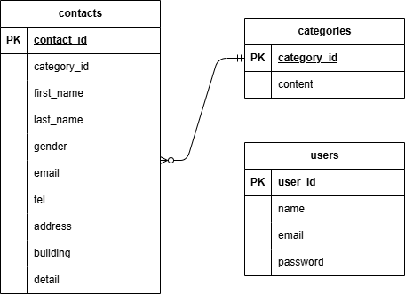

# お問い合わせフォーム

---

## 環境構築

---

Dockerビルド

- git clone git@github.com:yoki229/comprehension-test.git
- docker-compose up -d —build

*MYSQLは、OSによって起動しない場合があるのでそれぞれのPCに合わせてdocker-compose.ymlファイルを編集してください。

Laravel環境構築

- docker-compose exec php bash
- composer install
- .env.exampleファイルから.envを作成し、環境変数を変更
- php artisan key:generate
- php artisan migrate
- php artisan db:seed

## 使用技術

---

- PHP 8.1
- Laravel 8.1
- MySQL 8.0.26

## ER図

---

## URL

---

- 開発環境：http://localhost/
- phpMyAdmin：http://localhost:8080/